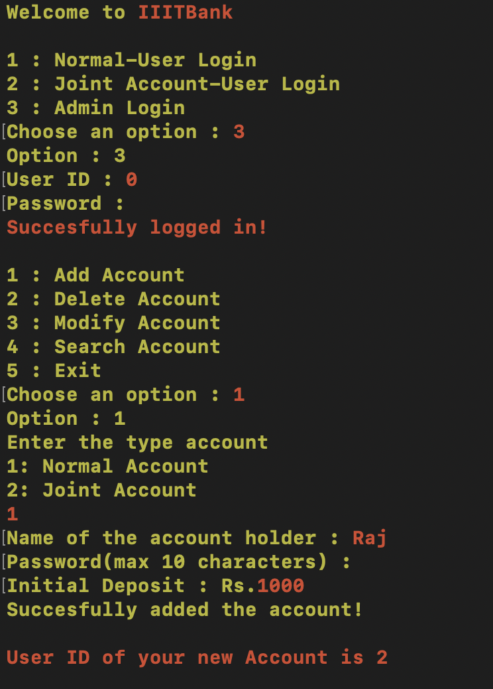
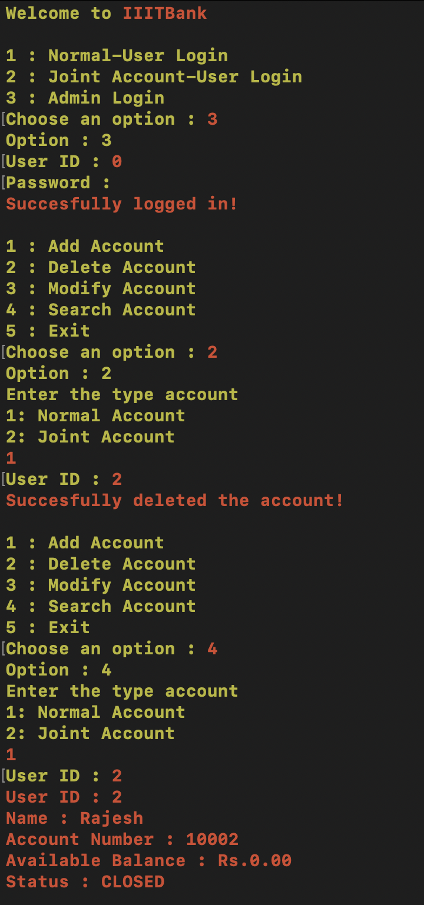

# BankManagementSystem

## How to execute?

- Firstly Add a new Admin using a file called "data.c"
- Change the Absolute path mentioned in the code.
- Now Compile and Run the Server:
```
cc server.c -o server.out
./server.out
```
- Compile and Run the Client
```
cc client.c -o client.out
./client.out
```
- Done!

## Outputs:

- On Running Client:
# 
- Logging Admin In, and creating Normal Account:
# 
- Admin Modifying Account:
# 
- Admin can Search and View Details of an Account
# 
- Admin can Delete Accounts
# 
- Logging Normal User In, and Viewing Data
# 
- User can Deposite and Withdraw Money from the Accounts(Obviously)
# 
- All the Operations of User are Validated, For eg:
# 
- Users can also Change their Passwords
# 
- Concurrency is taken care of in all the functions, For eg. Withdrawals at the same time:
# 
- But Users can View their Balances/Details Concurrently:
# 
